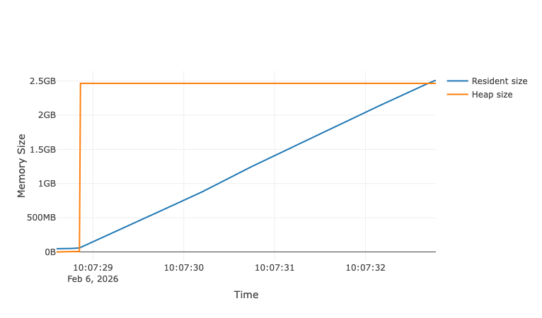
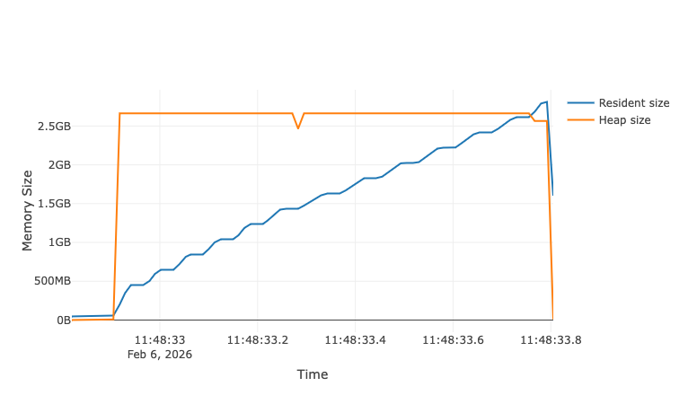
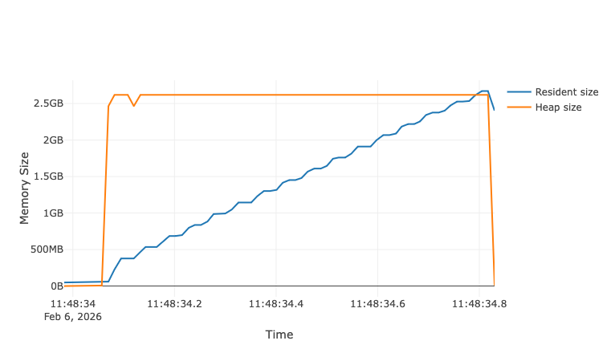
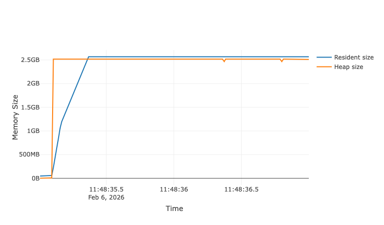
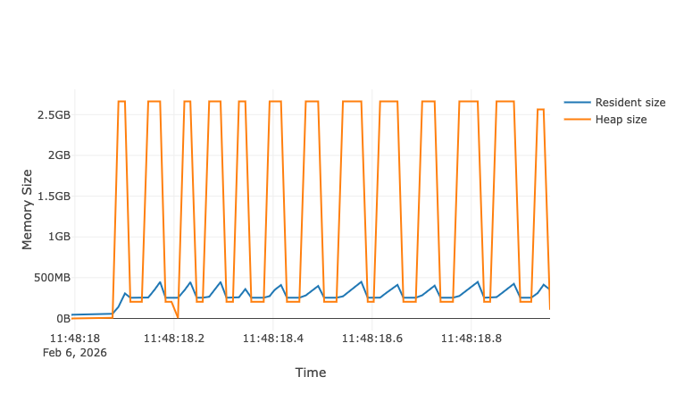
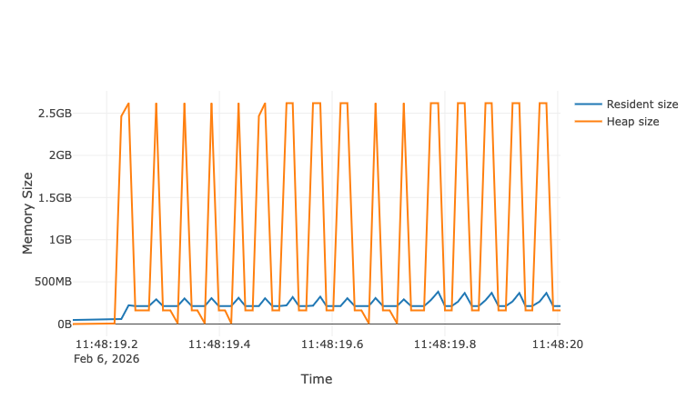
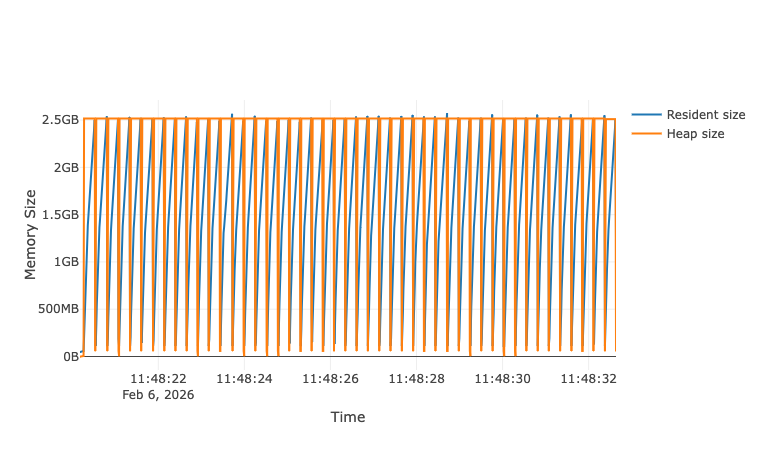

# Overview of loading and processing EDAX files

An EDAX dataset consists of a number of files representing output of x-ray spectrum imaging. Typical dataset directory will include:


```
C-12.bmp
C-12.ipr
C-12.spc
C-12.spd
C-12.xml
```

The `.spd` is the spectrum image itself: a binary format that includes an array of size `Nx * Ny* N_channels` where `(Nx, Ny)` are the image pixel dimensions and `N_channels` is the number of energy bins. The size of the array in the above example is `(800, 1024, 3000)`.

The `.ipr` and `.spc` relate to calibration.

The `.bmp` is a image of the sample (presumably visible spectrum?).

If reading an .spd file, the calibration of the spectrum image is loaded from the corresponding .ipr and .spc files stored in the same directory, or from specific files indicated by the user.

The `.xml` seems to include a small amount of microscope-related metadata:

```
<ExtendedSpectrumData>
  <SpectrumLabel Label="" />
  <Geometry WorkingDistance="15.00" />
  <Processing ICCShelfFactor="0.20" ICCTailFactor="0.20" ICCShiftFactor="0.50" />
</ExtendedSpectrumData>
```

The actual file specifications of the binary files are available at https://hyperspy.org/rosettasciio/file_specification/index.html#edax-file-specification  for the `.spd`, `.spc` and `.ipr` files.


## Loading EDAX files with Python

`Hyperspy`'s backend IO library, `RosettaSciIO` supports EDAX files and will load the binary spectrum image as a `np.memmap` array . See [here](https://hyperspy.org/rosettasciio/supported_formats/edax.html#edax-team-genesis-spc-spd) for a description, it's also useful to check how the `memmap` array is created: [rsciio/edax/_api.py#L801-L824](https://github.com/hyperspy/rosettasciio/blob/edd6bd39c79cb373279d4d73d85151b0fc8f0ad4/rsciio/edax/_api.py#L801-L824).

When using Rosetta,

```python
from rsciio import edax
ds = edax.file_reader(filename.spd, ipr_fname=filename.ipr)[0]
```

returns a plain `dict` with the keys `'data', 'axes', 'metadata', 'original_metadata']`, where `data` is the `np.memmap` object, `axes` is a dictionary containing info on the array axes (physical dimensions, sizes, names, etc.) while the `metadata` dictionaries contain additional metadata.

When using `hyperspy`, also need the `exspy` package: `https://hyperspy.org/exspy/`

```python
import hyperspy.api as hs
ds = hs.load(filename.spd, ipr_fname=filename.ipr)
```

where `ds` is now a `exspy.signals.eds_sem.EDSSEMSpectrum` type. Once in hypserpy, can use `ds.sum()` to create a 1d spectrum signal that can be plotted or saved. Also, `ds.as_lazy` will create a `dask` array that wraps the signal, nominally splitting the data across chunks (but with caveats noted in the next section).

## Operations

See `basicEDAXload.ipynb` for more detailed exploration (with plots!).

### spectrum

The primary operation that we need to support is the construction of spectrum for a given x-ray map. As a given array is a 2D spatial map with 1D energy channel along the final 3rd axis, this amounts to a sum over the spatial index axes, i.e.,

```python
ds[0]['data'].data.sum(axis=0).sum(axis=0)
```

will create a 1D spectrum for an entire x-ray map. Simple slicing and selecting in the spatial indices would allow calculation of spectrum for subsets of the full map, and data can be processed in chunks fairly simply.

### images

For a given energy index range, we can create a 2d intensity image with

```python
subsample = ds[0]['data'][:,:,index_start:index_end].sum(axis=-1)
```

### spectrum output: msa format

for 1D signals, hyperspy can save in MSA format directly. e.g.,

```python
import hyperspy.api as hs
ds = hs.load(filename.spd, ipr_fname=filename.ipr)
signal1D = ds.sum()
signal1D.save('full-file.msa', format='XY')
```

Can also use the underlying `rosettasciio` MSA exporter https://rosettasciio.readthedocs.io/en/v0.12.0/supported_formats/msa.html


## performance testing with `memray`

As the files are fairly large (2-3 Gb on disk), a web app that allows concurrent users could quickly run into memory issues, so we conducted a number of tests and monitored memory usage with [`memray`](https://github.com/bloomberg/memray).

### sums over axes

The primary operation to support is a sum over pixel ranges, at a limit approaching the full extent of an image.

Using the base `rsciio` `edax` reader, here's memory use over time for a basic sum of the data, `np.sum(ds['data'][:,:,:])` :



* heap size quickly increases to the max filesize as memory is alloted
* resident memory increases linearly as data is actually loaded into the array

In principle, we should be able to operate on chunks of the `memmap` array and avoid loading the full array into memory. The following plots show a comparison between a sum operation acting along each dimension in chunks

```python
if reload_memmap:
    ds = load_edax_spd(filename_base)

match axis:
    case 0:
        subsample = np.array(ds['data'][channel_start:channel_end,:,:])
    case 1:
        subsample = np.array(ds['data'][:,channel_start:channel_end,:])
    case 2:
        # worst case!
        subsample = np.array(ds['data'][:,:,channel_start:channel_end])

if reload_memmap:
    del ds

_ = np.sum(subsample)
assert len(subsample.shape) == 3
del subsample
```

with a `chunksize` of 64.

### axis 0 chunking

### axis 1 chunking

### axis 2 chunking



The first observation is that this looks pretty much like the raw `np.sum(ds['data'][:,:,:])` result... which was not expected. But [others have reported similar results](https://stackoverflow.com/q/45132940/9357244) where iterating over chunks does not release memory, and [one suggestion is to reconstruct the `memmap` between reads](https://stackoverflow.com/a/61472122/9357244), which pre-sumable forces some C-level collection?

The second observation is that the axis 2 chunking is unsurprisingly much slower (4-5 seconds rather than ~1 second).

Re-running and re-loading the base `ds` between reads results in a much lower max resident memory use for the axis 0 and 1 cases while axis 2 requires the full dataset every time:

### axis 0 chunking

### axis 1 chunking

### axis 2 chunking


It does seem, however, that `np` will allocate enough memory to fit the full array if any chunk is read but only the chunk being read will actually be used (i.e., heap size increases on file read, resident increase to fill just the chunk requested).

## Dask

Also tested using the hyperspy dask-wrapping functionality but it runs into a similar problem... essentially the full `np.memmap` array ends up passed to each worker even though the chunksize it operates on is small. So we would not gain any performance improvement out of the box (and would have additional burden of configuring dask clients...).

## Conclusions of performance testing

When using the `hyperspy` and `RosettaSciIO` functionality out of the box, we would probably have to handle having a full file in memory: even though chunking and `memmap` reconstruction can reduce resident memory use, the instant heap allocation for the full file seems potentially problematic. If files are not more than 2-5 Gb, then simply loading full files should be OK in some respects: simply queueing processing requests might be OK since processing over a full file is pretty quick. Worst case, if there are 10-20 concurrent users during a class it might take 10-20 seconds to get back a spectrum if you're at the back of the line.

If files are potentially much larger, or wait times are more important, we could:

* write our own reader? the file specs are available...
* Try forking and updating the reader (see [here](https://github.com/hyperspy/rosettasciio/blob/edd6bd39c79cb373279d4d73d85151b0fc8f0ad4/rsciio/edax/_api.py#L801-L824())): perhaps creating a separate memmap array for each chunk rather than a single memmap array that maps to chunk.


